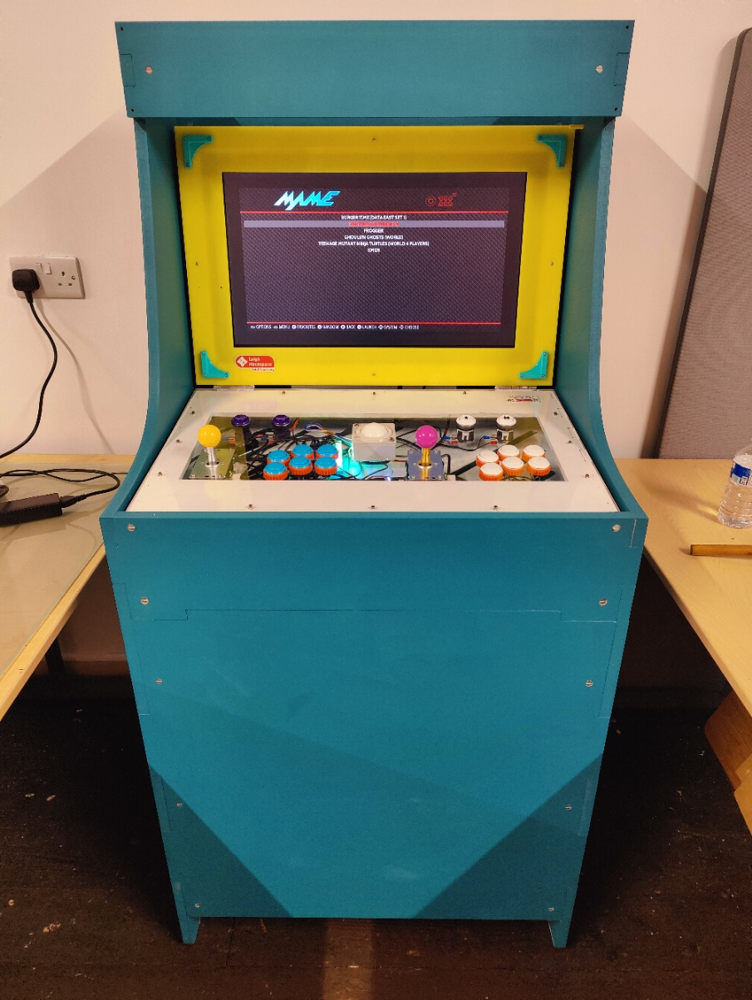

# Leigh Hackspace Collapsable Arcade Cabinet

Design files for the [Leigh Hackspace](leighhack.org) collapsible arcade cabinet.

## Requirements

* CNC with bed size of 80cm2 capable of milling 18mm MDF.
* 3D Printer
* Plenty of 9mm and 18mm MDF
* M3 bolts in 6mm and 12mm form
* M6 furniture bolts and nuts
* Fusion 360
* See the elctronics list

Please *study* the Fusion model before committing to this project.

Whilst I'm happy to answer reasonable questions, these files are provided firmly as-is.

## CNC

It's up to you to provide your own cuts for your own CNC.

The Fusion model should provide you with the manufacturing flats to get started.

## 3D Prints

You need to print the bumpers for the case, and one Pi mount.

## Electronics

Cooler Master GA241 23.8" VA Monitor
Raspberry Pi 4
Picade X HAT
Picase Wiring Loom
Phreak Mods Link EX Groove Quick Release 
Sanwa JLF-TP-8YT Arcade Joystick 
Sanwa OBSN-30 Screw In Japanese Arcade Button 
16mm Metal Illuminated Button
A 5V/3A Buck Converter with USB outs
2.1mm sockets and right angle plugs
3W speaker
Panel mount power switch rated for 4A.
Flat HDMI ribbon cable and adapters (down angled and flat)
4010 5V USB fan for the Pi

Attach a 2.1mm socket to the case, and wire the +ve to the switch.  Then wire the switch to
the buck converter and a spur to the monitor in the upper case.  Connect all grounds back to 
the socket.  Test for continuity before powering on.

The arcade panel is simply wired as you would for a Picade.  Please follow those instructions.  Use M3 bolts and nuts to attach the arcade stick to the console.

Stack the Picade to the Pi using M2.5 nylon mounts.  You should be able to push fit the Pi on to the Pi mount.  Screw the Pi mount, the buck coverter and the 3W speaker to the case.  Make sure to not interfere with the underside of the buttons for the console.

Solder a 2.1mm right angle plug to the cable you run to the upper half of the case for the monitor.  Plug the ribbon HDMI cable and power in to the monitor, and then mount the monitor to the case using short M6 bolts.

Attach the surround to the upper half, and the console to the lower half using M3 bolts.  The corners of the upper half should have bumpers attached to ensure adequate clearance.  Use longer M3 bolts for these.

UNDER NO CIRCUMSTANCES CLOSE THE CASE WITH THE STICK IN PLACE.

## Software

Follow Picade instructions for a standard Picade install.

## Contributing

This project is not open to external contributions, and is firmly provided as-is.

## License

[MIT](https://choosealicense.com/licenses/mit/)
